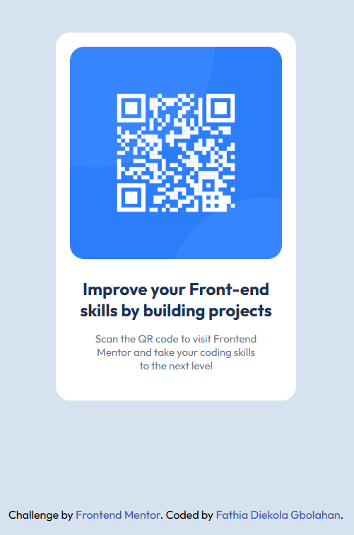

##  Screenshot

### Links

- Solution URL: https://github.com/Thia100/frontend-mentor/tree/main/qr-code-component-main
- Live Site URL: https://thia100.github.io/frontend-mentor/qr-code-component-main/index.html

## My process
--Read and understood the project brief.
--Broke down the layout into reusable sections.

### Built with
- Semantic HTML5 
- CSS3 custom properties

### What I learned
--Chrome dev tools
--Flexbox
--Media query
--Responsiveness

### Continued development
I want to continue focusing on mobile first approach as well as responsiveness.

## Author
- Frontend Mentor - [@yourusername](https://www.frontendmentor.io/profile/Thia100)
- X - [@Thia_wip](https://x.com/thia_wip)
- LinkedIn - [Fathia Diekola Gbolahan](https://www.linkedin.com/in/fathia-gbolahan/)

