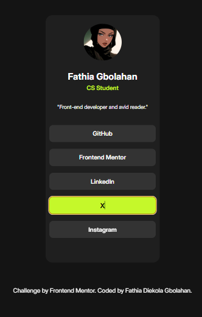

- [My process](#my-process)
  - [Built with](#built-with)
  - [What I learned](#what-i-learned)
  - [Continued development](#continued-development)
- [Author](#author)


### The challenge

Users should be able to:

- See hover and focus states for all interactive elements on the page


### Screenshot




### Links

- Solution URL: [solution URL](https://github.com/Thia100/frontend-mentor/tree/main/social-links-profile-main)
- Live Site URL: [live site URL](https://thia100.github.io/frontend-mentor/social-links-profile-main/index.html)

## My process

--Read and understood the project brief.
--Converted font-sizes from px to rem for better scalability.
--converted colors from hsl to hex code.
--linked google fonts to html
--Included personalised features; My profile picure, my actual social media handles
                                

### Built with

- Semantic HTML5 
- CSS3 custom properties
- Flexbox


### What I learned
--solidified use of media query
--use min-height instead of height to prevent overflow
--used flexbox on attribution class to prevent horizontal scrolling
--used min-height and max-width for responsive card on different devices

```css
.card{
  background-color: var(--card-bg);
  border-radius: 18px;
  max-width: 350px;
  min-height: 650px;
  padding: var(--padding);
}

```


### Continued development
--Study more on using min(max)-height, min(max)-width


## Author

- Frontend Mentor - [@Thia100](https://www.frontendmentor.io/profile/Thia100)
- X - [@thia_wip](https://x.com/thia_wip)
- LinkedIn - [Fathia Diekola Gbolahan](https://www.linkedin.com/in/fathia-gbolahan/)
- Instagram - [thia_wip](https://www.instagram.com/thia_wip)

